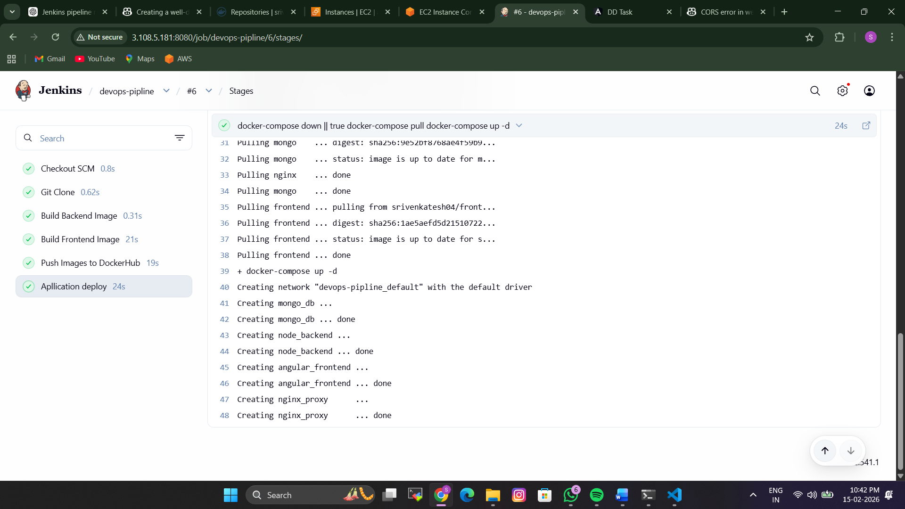
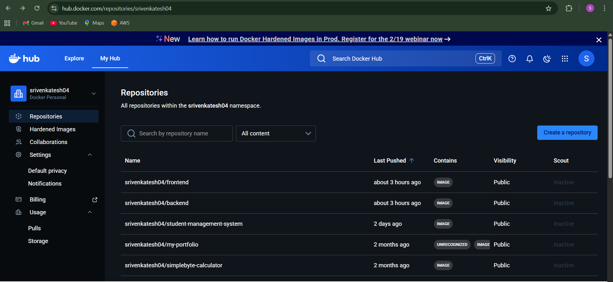
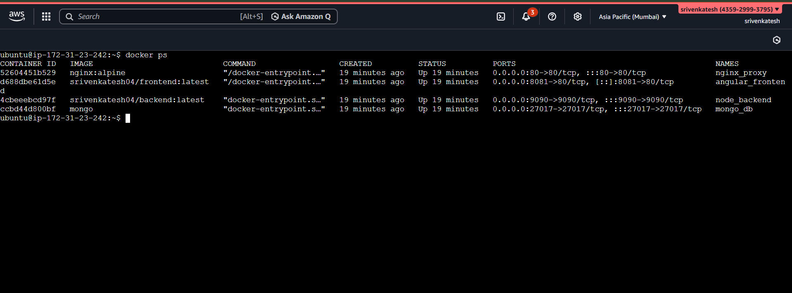
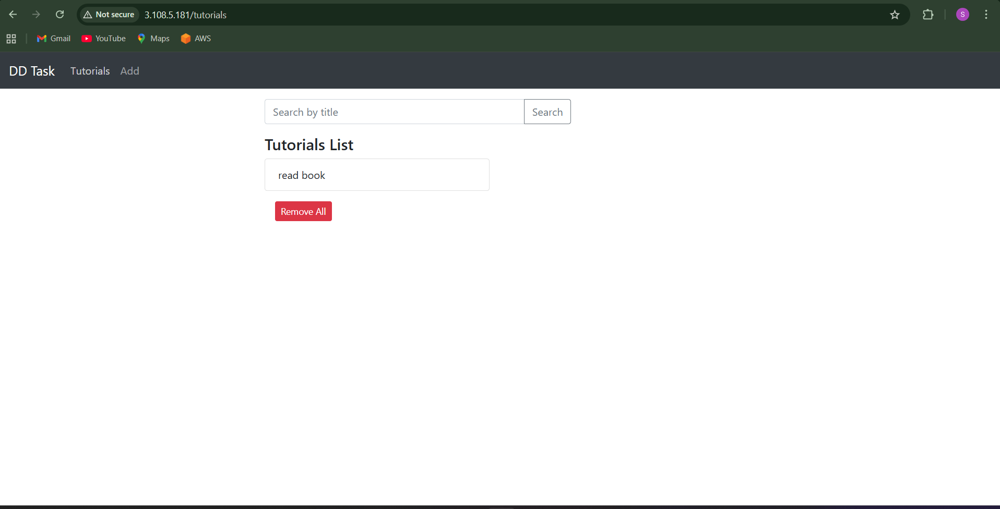

# 🚀 DevOps Project - MEAN Stack CRUD Application

A full-stack CRUD application built with the MEAN stack (MongoDB, Express.js, Angular 15, and Node.js) featuring complete CI/CD automation, containerization, and production-ready deployment using Jenkins, Docker, and Nginx.

## 📋 Table of Contents

- [Overview](#overview)
- [Architecture](#architecture)
- [Technologies Used](#technologies-used)
- [Prerequisites](#prerequisites)
- [Project Structure](#project-structure)
- [Setup Instructions](#setup-instructions)
  - [Local Development Setup](#local-development-setup)
  - [Docker Setup](#docker-setup)
- [CI/CD Pipeline](#cicd-pipeline)
- [Deployment](#deployment)
- [Screenshots](#screenshots)
- [API Endpoints](#api-endpoints)
- [Configuration](#configuration)
- [Troubleshooting](#troubleshooting)

---

## 🎯 Overview

This DevOps project demonstrates the complete lifecycle of a modern web application with automated CI/CD practices. The application manages a collection of tutorials where users can:

- ✅ **Create** new tutorials
- 📖 **Read/Retrieve** tutorial details
- ✏️ **Update** existing tutorials
- 🗑️ **Delete** tutorials
- 🔍 **Search** tutorials by title

---

## 🏗️ Architecture

```
┌─────────────────────────────────────────────────────────┐
│                     Nginx (Port 80)                     │
│              Reverse Proxy & Load Balancer              │
└──────────────────┬──────────────────────────────────────┘
                   │
         ┌─────────┴─────────┐
         │                   │
┌────────▼────────┐  ┌──────▼──────────┐
│   Frontend      │  │    Backend      │
│  Angular 15     │  │  Node.js +      │
│  (Port 8081)    │  │  Express        │
│                 │  │  (Port 9090)    │
└─────────────────┘  └────────┬────────┘
                              │
                     ┌────────▼────────┐
                     │    MongoDB      │
                     │  (Port 27017)   │
                     └─────────────────┘
```

---

## 🛠️ Technologies Used

### **Frontend**
- Angular 15
- TypeScript
- Bootstrap
- HTTPClient for API communication

### **Backend**
- Node.js
- Express.js
- Mongoose (MongoDB ODM)
- REST API

### **Database**
- MongoDB

### **DevOps Tools**
- **Jenkins** - CI/CD automation
- **Docker** - Containerization
- **Docker Compose** - Multi-container orchestration
- **Nginx** - Reverse proxy & web server
- **Docker Hub** - Container registry

---

## ✅ Prerequisites

Before you begin, ensure you have the following installed:

- **Node.js** (v18 or higher) - [Download](https://nodejs.org/)
- **npm** (comes with Node.js)
- **MongoDB** - [Download](https://www.mongodb.com/try/download/community)
- **Docker** - [Install](https://docs.docker.com/get-docker/)
- **Docker Compose** - [Install](https://docs.docker.com/compose/install/)
- **Jenkins** (for CI/CD) - [Install](https://www.jenkins.io/download/)
- **Git** - [Install](https://git-scm.com/downloads)

---

## 📁 Project Structure

```
DevOps-Project/
├── backend/                 # Node.js backend application
│   ├── app/
│   │   ├── config/         # Database configuration
│   │   ├── controllers/    # Business logic
│   │   ├── models/         # MongoDB models
│   │   └── routes/         # API routes
│   ├── server.js           # Entry point
│   ├── package.json
│   └── Dockerfile          # Backend container definition
│
├── frontend/               # Angular frontend application
│   ├── src/
│   │   ├── app/
│   │   │   ├── components/
│   │   │   ├── services/
│   │   │   └── models/
│   │   └── index.html
│   ├── package.json
│   └── Dockerfile          # Frontend container definition
│
├── Jenkinsfile             # CI/CD pipeline configuration
├── docker-compose.yaml     # Multi-container orchestration
├── nginx.conf              # Nginx reverse proxy config
└── README.md
```

---

## 🚀 Setup Instructions

### **Option 1: Local Development Setup**

#### **1. Clone the Repository**
```bash
git clone https://github.com/Srivenkatesh03/DevOps-Project.git
cd DevOps-Project
```

#### **2. Setup Backend (Node.js Server)**

```bash
# Navigate to backend directory
cd backend

# Install dependencies
npm install

# Update MongoDB credentials (optional)
# Edit app/config/db.config.js with your MongoDB connection string

# Start the backend server
node server.js
```

The backend will start on `http://localhost:9090`

#### **3. Setup Frontend (Angular Client)**

```bash
# Navigate to frontend directory (in a new terminal)
cd frontend

# Install dependencies
npm install

# Start the development server
ng serve --port 8081
```

The frontend will be available at `http://localhost:8081`

---

### **Option 2: Docker Setup** (Recommended)

#### **1. Clone the Repository**
```bash
git clone https://github.com/Srivenkatesh03/DevOps-Project.git
cd DevOps-Project
```

#### **2. Build Docker Images**

```bash
# Build backend image
docker build -t srivenkatesh04/backend:latest ./backend

# Build frontend image
docker build -t srivenkatesh04/frontend:latest ./frontend
```

#### **3. Run with Docker Compose**

```bash
# Start all services
docker-compose up -d

# Check running containers
docker ps

# View logs
docker-compose logs -f
```

#### **4. Access the Application**

- **Frontend**: http://localhost:8081
- **Backend API**: http://localhost:9090
- **Nginx Proxy**: http://localhost:80
- **MongoDB**: localhost:27017

#### **5. Stop the Application**

```bash
docker-compose down

# Stop and remove volumes
docker-compose down -v
```

---

## 🔄 CI/CD Pipeline

The project uses **Jenkins** for automated CI/CD with the following stages:

### **Pipeline Stages**

1. **🔍 Git Clone**
   - Clones the repository from GitHub
   - Ensures latest code is fetched

2. **🏗️ Build Backend Image**
   - Builds Docker image for Node.js backend
   - Tags image as `srivenkatesh04/backend:latest`

3. **🏗️ Build Frontend Image**
   - Builds Docker image for Angular frontend
   - Uses multi-stage build for optimization
   - Tags image as `srivenkatesh04/frontend:latest`

4. **📤 Push Images to DockerHub**
   - Authenticates with DockerHub
   - Pushes both frontend and backend images
   - Makes images available for deployment

5. **🚀 Application Deploy**
   - Stops existing containers
   - Pulls latest images from DockerHub
   - Starts application using docker-compose

### **Jenkins Setup**

1. **Install Required Plugins**
   - Docker Pipeline
   - Git Plugin
   - Docker Commons Plugin

2. **Configure DockerHub Credentials**
   ```
   Jenkins Dashboard → Manage Jenkins → Credentials → Add Credentials
   - ID: dockerhub
   - Username: your-dockerhub-username
   - Password: your-dockerhub-token
   ```

3. **Create Pipeline Job**
   ```
   New Item → Pipeline → Configure
   - Pipeline definition: Pipeline script from SCM
   - SCM: Git
   - Repository URL: https://github.com/Srivenkatesh03/DevOps-Project.git
   - Branch: main
   - Script Path: Jenkinsfile
   ```

4. **Trigger Build**
   - Manual: Click "Build Now"
   - Automatic: Configure GitHub webhook for push events

---

## 🌐 Deployment

### **Production Deployment Steps**

1. **Prepare Server**
   ```bash
   # Update system
   sudo apt update && sudo apt upgrade -y
   
   # Install Docker and Docker Compose
   curl -fsSL https://get.docker.com -o get-docker.sh
   sh get-docker.sh
   ```

2. **Clone Repository**
   ```bash
   git clone https://github.com/Srivenkatesh03/DevOps-Project.git
   cd DevOps-Project
   ```

3. **Configure Environment**
   - Update `nginx.conf` with your domain
   - Modify MongoDB credentials in backend config
   - Update Docker image names if using private registry

4. **Deploy Application**
   ```bash
   docker-compose up -d
   ```

5. **Verify Deployment**
   ```bash
   # Check container status
   docker-compose ps
   
   # Check logs
   docker-compose logs -f
   ```

### **Nginx Configuration**

The project uses Nginx as a reverse proxy to:
- Route requests to appropriate services
- Serve static frontend files
- Handle CORS and load balancing
- Provide SSL termination (production)

---

## 📸 Screenshots

### 1. CI/CD Pipeline Configuration
> **** Jenkins pipeline stages showing successful build
```
- Shows all 5 stages completing successfully
- Build duration and status
```


### 2. DockerHub Repository
> ****: Images published on DockerHub
```
- srivenkatesh04/backend:latest
- srivenkatesh04/frontend:latest
- Image details and tags
```

### 3. Application Deployment
> ****: Running containers via docker-compose
```
- mongo_db, node_backend, angular_frontend, nginx_proxy
- All containers in "Up" status
```

### 5. Working Application UI
> ****: 
```
- Tutorial list page
- Add new tutorial form
- Edit tutorial interface
- Search functionality
- Delete confirmation
```


---

## 📡 API Endpoints

### **Tutorial Endpoints**

| Method | Endpoint | Description |
|--------|----------|-------------|
| `GET` | `/api/tutorials` | Retrieve all tutorials |
| `GET` | `/api/tutorials/:id` | Get a specific tutorial by ID |
| `POST` | `/api/tutorials` | Create a new tutorial |
| `PUT` | `/api/tutorials/:id` | Update a tutorial |
| `DELETE` | `/api/tutorials/:id` | Delete a tutorial |
| `DELETE` | `/api/tutorials` | Delete all tutorials |
| `GET` | `/api/tutorials/published` | Get all published tutorials |
| `GET` | `/api/tutorials?title=[keyword]` | Search tutorials by title |


---

## ⚙️ Configuration

### **Backend Configuration** (`backend/app/config/db.config.js`)

```javascript
module.exports = {
  url: process.env.MONGO_URL || "mongodb://localhost:27017/meanDB"
};
```

### **Frontend Configuration** (`frontend/src/app/services/tutorial.service.ts`)

Update the API base URL:
```typescript
const baseUrl = 'http://localhost:9090/api/tutorials';
```

### **Docker Compose Environment Variables**

```yaml
environment:
  - MONGO_URL=mongodb://mongo:27017/meanDB
  - PORT=9090
```

### **Nginx Configuration** (`nginx.conf`)

- Proxies frontend requests to Angular container (port 8081)
- Proxies API requests to backend container (port 9090)
- Handles CORS headers

---

## 🐛 Troubleshooting

### **Issue: Containers not starting**
```bash
# Check logs
docker-compose logs

# Rebuild images
docker-compose build --no-cache
docker-compose up -d
```

### **Issue: Backend cannot connect to MongoDB**
- Ensure MongoDB container is running: `docker ps`
- Check environment variables in docker-compose.yaml
- Verify network connectivity between containers

### **Issue: Frontend cannot reach Backend API**
- Check backend is running on port 9090
- Verify API URL in `frontend/src/app/services/tutorial.service.ts`
- Check browser console for CORS errors

### **Issue: Jenkins pipeline fails**
- Verify DockerHub credentials are configured
- Ensure Jenkins has Docker access: `sudo usermod -aG docker jenkins`
- Check Jenkins agent has sufficient permissions

### **Issue: Port already in use**
```bash
# Find process using port
sudo lsof -i :8081
sudo lsof -i :9090

# Kill process
sudo kill -9 <PID>
```

---

## 📝 Additional Notes

### **Container Ports**

| Service | Container Port | Host Port |
|---------|----------------|-----------|
| Frontend | 80 | 8081 |
| Backend | 9090 | 9090 |
| MongoDB | 27017 | 27017 |
| Nginx | 80 | 80 |

### **Data Persistence**

MongoDB data is persisted using Docker volumes:
```yaml
volumes:
  mongo_data:
```

Data persists even after containers are stopped/removed.

---

